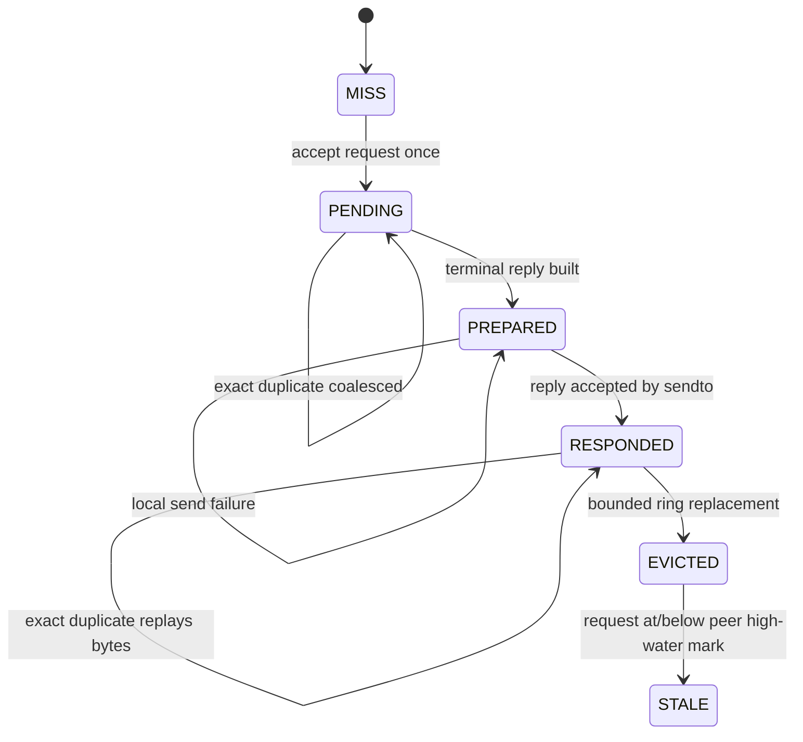

# SPF direct-IP RX lifecycle

This document describes the protocol-v3 RX lifecycle implemented by the
direct-IP gadget. The control socket is owned by the main epoll thread. Slow
IIO setup, DMA capture, UDP drain, and IIO teardown are owned by one worker.
The control thread never waits for those operations while serving a request.

## Session states

```mermaid
stateDiagram-v2
    [*] --> IDLE
    IDLE --> STARTING: accept unique START_RX
    STARTING --> ARMED: worker reports resources ready
    STARTING --> STOPPING: STOP or shutdown
    STARTING --> REAPABLE: startup failure
    ARMED --> RUNNING: STARTED sent; release run gate
    ARMED --> STOPPING: STOP or shutdown
    RUNNING --> STOPPING: STOP or shutdown
    RUNNING --> REAPABLE: finite stream completes or fails
    STOPPING --> REAPABLE: worker releases all resources
    REAPABLE --> IDLE: completion event; join and tombstone
    IDLE --> IDLE: STOP for completed stream
```

`generation` identifies a local worker attempt and is never reused in one
daemon lifetime. `stream_id` identifies IQ fragments and control replies.
`completed_stream_id` is retained after reap so a delayed STOP can be answered
without touching a newer stream.

The worker sends `READY` only after IIO resources and helper threads exist. It
then waits on a run gate. The main thread sends `STARTED` first and releases
the run gate only after the response has been accepted by `sendto()`. The
worker reports `DONE` only after helper threads have stopped, timestamp state
has been restored, and IIO resources have been destroyed. A STOP response is
therefore delayed until ownership has really been released, without blocking
the control socket.

## Request replay states

Identity is source IPv4 address, source UDP port, request ID, and exact request
bytes. The same ID with different bytes returns `-EALREADY`. Exact duplicates
cannot launch or stop a worker twice. Sixteen request entries and eight peer
high-water records bound memory use. Serial-number comparison handles request
ID wrap. A future protocol should add a client-session nonce to distinguish a
host process that restarts while reusing the same source port.

## Ownership invariants

- At most one protocol-v3 RX worker owns `cf-ad9361-lpc`.
- A legacy RX START is refused while protocol-v3 RX owns or releases DMA; it
  cannot cancel the v3 worker or steal ownership.
- A new START returns `-EBUSY` until the prior worker has reported cleanup.
- Capability and time-anchor queries remain serviceable during setup/cleanup.
- Worker eventfds are distinct: startup, run, quit, and done cannot consume one
  another's state.
- Stale worker events cannot advance another stream generation.
- Natural finite completion is reaped without requiring a host STOP.
- A wrong stream ID cannot stop the active worker.
- The main thread joins only after DONE, except during process shutdown.

## Focused regression gates

The native `spf_ip_lifecycle` test covers transitions, generation rejection,
pending/prepared/responded replay, collisions, peer isolation, bounded
eviction, pending-entry preservation, and rejection of an evicted old START.
The existing protocol, frame-pipeline, and transport tests remain independent
gates. Hardware promotion additionally requires repeated finite captures at
1--3 MS/s, concurrent two-radio operation, high-rate integrity, TX2 loopback,
USB regression, and process restart recovery.

## Deliberate limits

This first implementation does not add a wall-clock cleanup watchdog or expose
lifecycle counters in the wire protocol. A stuck kernel/IIO teardown can still
require supervisor restart. Those are follow-up hardening items; they do not
justify returning `STOPPED` early or reusing uncertain DMA ownership.
