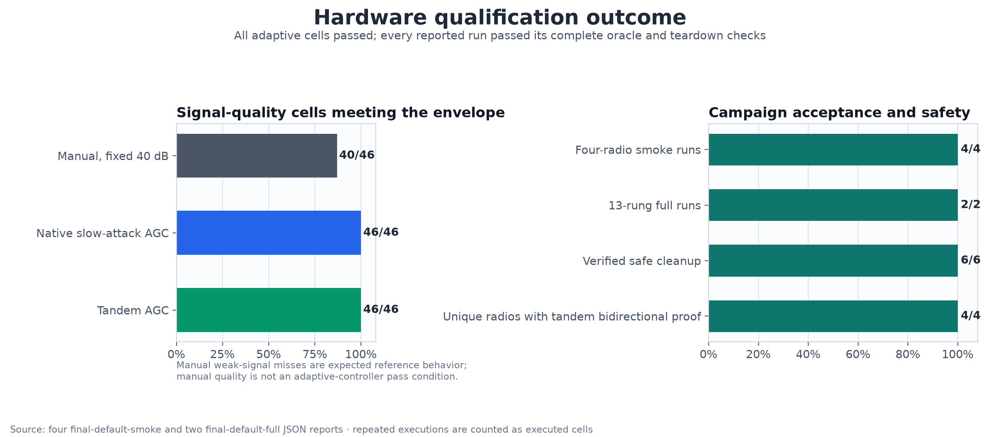
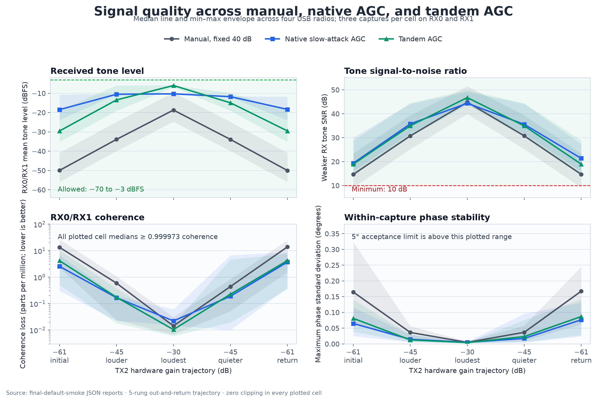
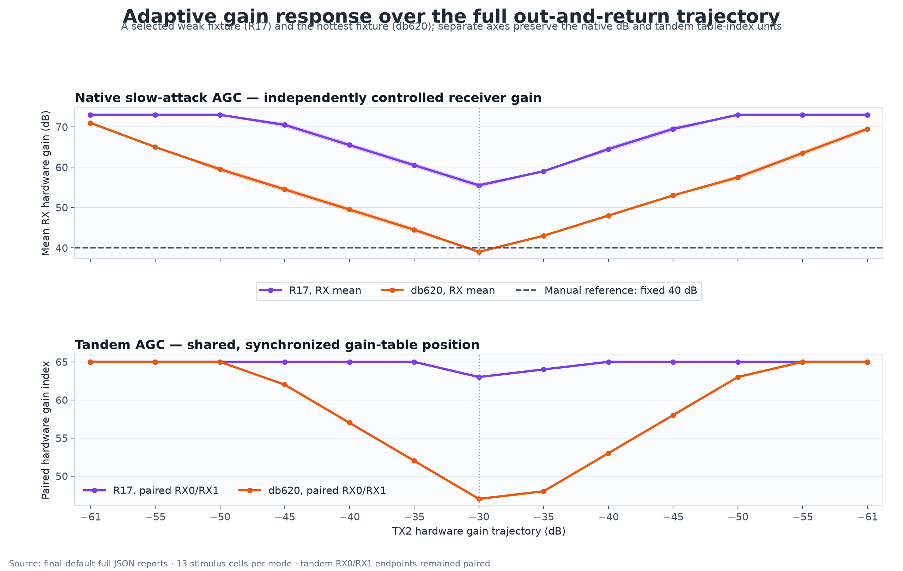

# Tandem AGC hardware signal-quality testing

**Date:** 2026-08-24

**Status:** **PASS within the scope defined in this report**

**Tested firmware:** `v0.41-plutoplus-spf-tandem-agc-v8-rc2`

**Primary question:** Does tandem AGC preserve usable, coherent RX0/RX1 IQ across a controlled TX2 loudness sweep, compared with fixed manual gain and native AD9361 AGC?

## Executive summary

This campaign developed and exercised one hardware test that applies the same deterministic TX2 tone trajectory to three receive modes:

1. fixed 40 dB manual gain on RX0 and RX1;
2. independent native AD9361 `slow_attack` AGC;
3. synchronized tandem `AUTO` gain control.

The test measures both receive streams with one analyzer and records tone level, tone SNR, clipping, frequency error, RX0/RX1 coherence, differential-phase stability, receive-gain response, tandem metadata, and cleanup state. It also proves that the commanded RF stimulus actually changed and that each adaptive controller responded on both the louder and quieter legs.

The result is positive:

- all four attached USB radios passed the five-rung smoke trajectory;
- a selected weak fixture (R17) and the hottest fixture response (db620) also passed the 13-rung full trajectory;
- native AGC passed **46/46** executed signal-quality cells;
- tandem AGC passed **46/46** executed signal-quality cells;
- tandem AGC proved a paired gain decrease for louder TX and a paired gain increase on the quieter return on every unique radio;
- no adaptive capture clipped;
- every run completed with verified TX mute, DDS disable, selector reset, RX restoration, and tandem release.

Manual mode met the reference requirements but passed only **40/46** individual quality cells. Its six misses were repeatable weak-signal SNR results on R17 and R18. That is expected fixed-gain behavior, not an adaptive-controller defect: manual mode is used to validate the fixture, stimulus tracking, and retrace, while every native and tandem cell is required to meet the absolute quality envelope.



## Motivation

Prior coverage established important adjacent facts, but did not answer the end-to-end quality question in one reusable hardware test:

- the TX2 fixture test could emit a real tone into both receive branches, but used one transmit level and fixed manual receive gain;
- native AGC qualification showed gain response to weak and strong stimuli, but did not score the AGC IQ with the same analyzer used for manual IQ;
- tandem qualification proved ownership, paired gain indexes, bidirectional events, and sample-aligned metadata, but generally discarded adaptive IQ rather than comparing its quality with manual and native AGC;
- RTL tests exercised detector levels and paired stepping, but not the physical RF path or captured IQ.

Controller-state success alone is insufficient. A gain controller can move in the expected direction while the RF path is absent, one receive arm is saturated, a fixed spur is mistaken for the stimulus, the two receivers lose phase coherence, or transition frames are misinterpreted. Conversely, a clean tone alone does not prove that native or tandem AGC actually responded.

The new test therefore combines four kinds of evidence:

1. **fixture evidence** — both RX paths receive the commanded TX2 tone;
2. **stimulus evidence** — measured manual tone changes track the commanded TX2 gain trajectory and retrace repeated levels;
3. **quality evidence** — both RX streams meet a common absolute envelope;
4. **control evidence** — native gain changes per receiver and tandem gain changes as a synchronized pair in the correct directions.

## Test approach

### Physical signal path

The bench mapping is:

```text
AD9361/IIO TX2
    │
    │ 100 kHz DDS tone, scale 1.0
    ▼
TX2 RF connector ── fixture / passive split ──┬── bench RX0 = AD9361/IIO RX1
                                              └── bench RX1 = AD9361/IIO RX2
```

The campaign conservatively credited **0 dB** of physical fixture loss. Safety therefore did not depend on an assumed pad: the strongest authorized TX2 hardware gain was `-30 dB`, meeting the required 30 dB effective-attenuation boundary by transmitter backoff alone. The test checks actual TX2 gain readback at every rung. TX1 remains below `-80 dB` throughout.

### Stimulus trajectories

Two weak-to-strong-to-weak trajectories were used:

| Profile | TX2 hardware-gain trajectory |
|---|---|
| Smoke | `-61, -45, -30, -45, -61 dB` |
| Full | `-61, -55, -50, -45, -40, -35, -30, -35, -40, -45, -50, -55, -61 dB` |

The return leg is intentional. It distinguishes a controller that only reduces gain under a louder stimulus from one that also recovers gain when the stimulus becomes quieter. Repeated levels provide a retrace check against hysteresis, ineffective TX gain control, or a fixed spectral spur.

### Receive modes

Each trajectory runs in three fresh receive sessions:

| Mode | Configuration | Required control evidence |
|---|---|---|
| Manual | RX0/RX1 fixed at 40 dB | Tone follows commanded TX step direction and magnitude; repeated levels retrace |
| Native AGC | RX0/RX1 independently use `slow_attack` | Each receiver reduces gain outbound and recovers gain on return; at least 1 dB span |
| Tandem AGC | Metadata ABI 2 tandem `AUTO` | RX indexes stay paired; louder step proves decrease; quieter step proves increase |

Tandem `AUTO` is conditioned at the median distinct trajectory level, `-45 dB`, after the metadata buffer opens. Priming must reach a stable paired equilibrium and is recorded, but it is not part of the IQ-quality verdict. The measured trajectory then restarts from `-61 dB`.

### Capture configuration

| Parameter | Value |
|---|---:|
| Sample rate | 2.5 MS/s |
| Samples per RX channel per refill | 65,536 |
| Tone | 100 kHz complex CW |
| DDS scale | 1.0 |
| Kernel buffers | 2 |
| Required stable frames | 3 |
| Measurement frames per cell | 3 |
| Analyzer transient discard | 1,024 samples |
| Analyzed samples per measurement/RX | 64,512 |
| Maximum settle frames | 64 |
| Per-cell settle timeout | 2.5 s |

Settling is evidence-based rather than sleep-based:

- manual gain must be exactly stable;
- native gain uses a bounded per-RX stability window and brackets every refill with gain readback;
- tandem requires paired indexes, one ownership epoch, unchanged transition count, and no gain event across the stable window.

### Absolute quality envelope

The same analyzer and limits are applied to both RX streams:

| Metric | Acceptance |
|---|---:|
| Tone SNR | at least 10 dB on each RX |
| Tone level | `-70` to `-3 dBFS` on each RX |
| Clipping fraction | exactly 0 |
| RX0/RX1 coherence | at least 0.98 |
| Within-capture differential-phase standard deviation | at most 5° |
| Tone-frequency error | at most 250 Hz absolute |

Every native and tandem cell must pass. Manual mode must pass the strongest reference cell and demonstrate valid stimulus tracking/retrace; weak manual degradation remains visible in the report instead of being misclassified as an AGC failure.

## Implementation

The implementation separates stimulus/control mechanics from signal analysis and tandem metadata:

| Campaign source path | Responsibility |
|---|---|
| `tests/radio_hardware/tandem_quality.py` | Three-mode matrix, settling, safety, evidence evaluation, atomic report generation |
| `tests/radio_hardware/tone_quality.py` | Self-contained dual-RX CS16 tone, SNR, clipping, coherence, frequency, and phase analysis |
| `tests/radio_hardware/metadata_abi.py` | Tandem HOLD/AUTO request builder and strict metadata/event parser |
| `tests/radio_hardware/test_tandem_agc_quality.py` | Hardware-gated pytest entry point |
| `scripts/run_tandem_agc_quality_hardware.sh` | Manifest-pinned host libiio setup and narrow test invocation |
| `tests/radio_hardware/test_tandem_*_oracles.py` | Synthetic and planted-failure coverage for quality, ABI, settling, control evidence, priming, and verdict logic |

The report publication is deliberately report-only. The checked-out firmware base was source commit [`19d146a62bdc`](https://github.com/misko/plutosdr-fw/commit/19d146a62bdc7c468618ad9f83332f110c0629b6). The harness files were uncommitted campaign artifacts and are not contained in that commit; their executed contents are identified by SHA-256 below. Landing the reusable harness on `main` is a separate change.

| File | SHA-256 |
|---|---|
| `tandem_quality.py` | `c612555d0d5b270eb4077ac81352c7b9cf69a42687b806d8116cbed908d60a29` |
| `tone_quality.py` | `885d0080765ff32faa9bab4c9053d2d2d8d34c96e0dffaa19cdbc3c580457b9f` |
| `metadata_abi.py` | `5c4701951fbd64f584db6cb2ebd3e7840578eda8649443b6f3e2770d1b895a2a` |
| `run_tandem_agc_quality_hardware.sh` | `1050ee12869f38a24b661a0c206dfd9239a32279951496b27a7250f93b37ef2a` |

### Tandem request and evidence

The qualification request used:

- low-power threshold `20`;
- large-LMT threshold `58`;
- large/small ADC overload thresholds `35/34`;
- initial gain `40 dB`;
- paired minimum/maximum gain constraints;
- bounded observation and event capacities.

The ADC thresholds are qualification settings chosen to exercise decrease and recovery across the local fixture range. They do not replace the production request-builder defaults.

The metadata parser rejects malformed sizes, invalid CRC/provenance, unsafe metadata flags, gain-read failures, event/observation overflow, dummy gains, mixed streams or ownership epochs, backward sequences, impossible transition accounting, unpaired indexes, and invalid event steps. Captured consecutive events must move both receivers together by exactly one gain-table index.

Provider frame rejection can create an accounted gap around a real gain transition. In that case the verdict accepts direction evidence only when the metadata proves a real buffer gap, transition-count growth, paired endpoint motion in the expected direction, and endpoint motion no larger than the transition delta. Initial priming events never count as the required quieter-return proof.

### Safety and lifecycle hardening

The hardware runner includes:

- exact serial selection and exact firmware-pattern attestation;
- one canonical per-radio writer lock shared by hardware suites;
- rejection of non-finite attenuation, gain, and timeout inputs;
- a strongest-manual topology and clipping preflight before adaptive modes;
- actual TX2 gain readback and effective-attenuation checks at every level;
- independent best-effort muting of TX1, TX2, every DDS channel, and all four selectors;
- independent cleanup readback verification even if an earlier mute operation fails;
- synchronous tandem release followed by IDLE/fault/FIFO checks;
- atomic JSON updates after every completed cell.

### Offline verification

Before RF execution, the complete non-hardware oracle suite passed:

```text
90 passed, 3 hardware-gated tests deselected
```

The oracles include planted regressions for cumulative gain creep, first-measurement jumps, static cross-RX offsets masquerading as AGC movement, missing native recovery, wrong-direction tandem response, event-sequence holes, invalid transition accounting, hidden-event gap handling, unsafe metadata flags, inert TX stimulus, NaN/Infinity safety inputs, and cleanup failures. Targeted Ruff checks, format checks, Python compilation, runner shell syntax, and `git diff --check` also passed.

## Test environment and deployment

Durable RAM-boot receipts and pre-run artifact records established that all four radios were already RAM-running the exact required image. Each hardware JSON report independently re-attested the runtime firmware version, kernel, metadata ABI, serial, USB URI, and host libiio commit. The campaign therefore did not perform a redundant reboot or flash.

| Item | Identity |
|---|---|
| Firmware version | `v0.41-plutoplus-spf-tandem-agc-v8-rc2` |
| Firmware source commit | `19d146a62bdc7c468618ad9f83332f110c0629b6` |
| Firmware DFU SHA-256 | `9f550f78a6fce95749bf98f8d84ab4ee750ed0e7482c24b4c788897730cfeb4f` |
| Kernel | `5.15.0-g85430d6efec2` |
| Metadata ABI | `2` |
| Host libiio source | `6305ea1d43436ff8bdd83aa6c9e5abf7244aa5f7` |
| pylibiio | local binding from the same pinned libiio source |

The older repository-local `build/pluto.dfu` was not used.

| Radio | Serial | USB URI during campaign | Profiles |
|---|---|---|---|
| R18 | `1040007c4a94000211000b009186843ef2` | `usb:3.17.5` | smoke |
| db696 | `winbond-db6968136727402c` | `usb:3.19.5` | smoke |
| db620 | `winbond-db620818a328172c` | `usb:5.25.5` | smoke, full |
| R17 | `104000bac4950008230026001b440a003a` | `usb:5.27.5` | smoke, full |

The hardware invocation was serial-attested and bounded to the one quality test:

```bash
PYTHON=/path/to/spf/.venv/bin/python \
IIO_SOURCE=/path/to/libiio \
scripts/run_tandem_agc_quality_hardware.sh \
  --tandem-quality-hardware \
  --tx2-loopback \
  --radio-serial SERIAL \
  --firmware-pattern '^v0[.]41-plutoplus-spf-tandem-agc-v8-rc2$' \
  --loopback-attenuation-db 0 \
  --tandem-quality-profile PROFILE \
  --tandem-quality-output OUTPUT_DIRECTORY
```

## Campaign execution

Six end-to-end hardware invocations were retained:

| Radio | Profile | UTC interval | Runtime | Verdict | Cleanup |
|---|---|---|---:|---|---|
| R18 | smoke | 17:27:47–17:27:54 | 6.727 s | PASS | verified |
| db696 | smoke | 17:27:54–17:28:01 | 6.792 s | PASS | verified |
| db620 | smoke | 17:28:02–17:28:09 | 7.038 s | PASS | verified |
| R17 | smoke | 17:28:09–17:28:16 | 6.957 s | PASS | verified |
| R17 | full | 17:28:34–17:28:50 | 16.490 s | PASS | verified |
| db620 | full | 17:28:51–17:29:07 | 16.446 s | PASS | verified |

The executions contain:

- 60 smoke mode/rung cells and 180 smoke measurement captures;
- 78 full-profile mode/rung cells and 234 full measurement captures;
- 138 total mode/rung cells and 414 quality captures;
- 26,707,968 analyzed complex samples per RX channel after transient removal.

R17 and db620 appear in both profiles, so this represents six executions on four unique radios, not six independent devices.

## Results

### Four-radio smoke comparison

The signal-quality figure shows cell-summary medians across the four radios. Each line is the cross-radio median; the shaded region is the complete min–max fixture range. SNR uses the weaker RX branch, while tone level averages RX0 and RX1. Coherence is plotted as loss from perfect in parts per million so the very small differences remain visible.



Observed smoke cell-summary results, including the failing manual weak-signal cells:

| Mode | Valid cells | SNR range | Tone range | Minimum coherence | Maximum phase std. | Maximum frequency error | Clipping |
|---|---:|---:|---:|---:|---:|---:|---:|
| Manual fixed | 16/20 | 9.154–51.954 dB | -56.158 to -9.255 dBFS | 0.99997301 | 0.3234° | 16.803 Hz | 0 |
| Native slow-attack | 20/20 | 15.922–51.093 dB | -24.289 to -9.993 dBFS | 0.99999118 | 0.1312° | 16.808 Hz | 0 |
| Tandem AUTO | 20/20 | 14.165–51.389 dB | -35.696 to -5.424 dBFS | 0.99998954 | 0.1416° | 16.805 Hz | 0 |

Per-radio weak-level and control response:

| Radio | Manual valid / minimum SNR | Native valid / minimum SNR | Native gain span RX0/RX1 | Tandem valid / minimum SNR | Tandem index span | Captured tandem increase/decrease |
|---|---:|---:|---:|---:|---:|---:|
| R18 | 3/5, 9.154 dB | 5/5, 16.408 dB | 19/18 dB | 5/5, 14.580 dB | 4, indexes 61–65 | 3/3 |
| R17 | 3/5, 9.363 dB | 5/5, 15.922 dB | 17/18 dB | 5/5, 14.165 dB | 2, indexes 63–65 | 0/0; gap-accounted proof |
| db620 | 5/5, 23.383 dB | 5/5, 27.300 dB | 31/32 dB | 5/5, 28.683 dB | 18, indexes 47–65 | 13/10 |
| db696 | 5/5, 19.921 dB | 5/5, 22.273 dB | 29/29 dB | 5/5, 23.264 dB | 14, indexes 51–65 | 9/10 |

Manual’s four smoke misses are exactly the outbound and return `-61 dB` cells on R18 and R17. On R17, RX0 remained above 10 dB while RX1 fell below it, which correctly invalidated the dual-RX cell. Manual stimulus evidence nevertheless passed on every radio: the largest commanded-versus-measured step error was 0.291 dB against a 3 dB limit, and the largest repeated-level retrace spread was 0.150 dB.

### Level regulation

The 31 dB TX stimulus swing produced the following combined RX0/RX1 tone-envelope widths. Each value is the highest minus lowest cell-summary tone level across both receive branches and all rungs, so it includes static branch imbalance as well as temporal level regulation.

| Radio | Manual fixed | Native slow-attack | Tandem AUTO |
|---|---:|---:|---:|
| R18 | 31.583 dB | 12.995 dB | 27.584 dB |
| R17 | 33.165 dB | 14.056 dB | 30.272 dB |
| db620 | 31.933 dB | 2.058 dB | 13.730 dB |
| db696 | 31.404 dB | 5.891 dB | 20.986 dB |

Native slow-attack AGC produced the narrowest combined tone envelope on every fixture. Tandem AUTO’s demonstrated property in this campaign is coordinated, paired gain movement while preserving the quality envelope. The test does **not** claim that tandem produces tighter amplitude regulation or universally higher SNR than native AGC.

### Full-profile gain response

A selected weak fixture (R17) and the hottest fixture response (db620) received the denser 13-rung out-and-return test. The two panels below intentionally use different units: native gain is AD9361 hardware gain in dB, while tandem gain is the shared hardware-table index. Those quantities must not be compared numerically.



| Radio | Manual valid / minimum SNR | Native valid / minimum SNR | Tandem valid / minimum SNR | Native gain span | Tandem span / visible events | Runtime |
|---|---:|---:|---:|---:|---:|---:|
| R17 | 11/13, 9.365 dB | 13/13, 15.918 dB | 13/13, 14.096 dB | 17/18 dB | 2 indexes, gap proof | 16.490 s |
| db620 | 13/13, 23.404 dB | 13/13, 27.750 dB | 13/13, 28.618 dB | 32/32 dB | 18 indexes, 10 increase / 3 decrease | 16.446 s |

Across all six runs, native and tandem each passed **46/46 cells** and **138/138 individual measurement frames**. Across all individual adaptive frames, the observed extrema were:

| Metric | Adaptive-frame extrema | Acceptance |
|---|---:|---:|
| Tone SNR | 14.081 dB | at least 10 dB |
| Tone level | -35.701 to -5.285 dBFS observed | -70 to -3 dBFS |
| RX0/RX1 coherence | 0.99998099 | at least 0.98 |
| Phase deviation | 0.1705° | at most 5° |
| Absolute frequency error | 16.824 Hz | at most 250 Hz |
| Clipping | 0 | exactly 0 |

### Tandem pairing and bidirectional response

Smoke settled tandem index paths were:

| Radio | Paired settled path |
|---|---|
| R18 | `65 → 65 → 61 → 65 → 65` |
| R17 | `65 → 65 → 63 → 65 → 65` |
| db620 | `65 → 62 → 47 → 58 → 65` |
| db696 | `65 → 65 → 51 → 62 → 65` |

In every run, at least one louder step produced a lower paired index and at least one quieter step produced a higher paired index. Other rungs could legitimately remain in deadband or at a gain-table clamp. All captured RX0/RX1 endpoints and every explicit event record were paired exactly.

Priming at `-45 dB` established these paired equilibria before the measured smoke path:

| Radio | Primed endpoint | Priming events |
|---|---:|---:|
| R18 | 65/65 | 20 |
| R17 | 65/65 | 15 |
| db620 | 58/58 | 11 |
| db696 | 62/62 | 12 |

Across all six runs, 460 tandem metadata buffers, including priming, were inspected and contained 142 explicit event records. No device, event, or observation overflow was accepted.

R17 deserves explicit qualification. Provider-frame gaps hid the trajectory’s explicit event records in both profiles. Its direction proof therefore combines transition-count deltas with paired settled-endpoint movement. This proves that the paired controller moved in the expected directions; it does not claim that every intermediate one-index event was directly observed.

## Safety and cleanup results

All six executions recorded:

- TX1 and TX2 restored to `-89.75 dB`;
- all eight present DDS sources with raw and scale equal to zero;
- all four FPGA selectors at `ZERO` (`3`);
- RX0 and RX1 restored to manual 40 dB;
- tandem state `IDLE`;
- tandem fault flags, FIFO level, and overflow count equal to zero;
- no cleanup failures.

The strongest authorized TX setting was `-30 dB`, producing exactly the required 30 dB effective attenuation with zero physical attenuation credited. This is safe under the encoded campaign requirement, but it has no arithmetic margin. Passive attenuation remains operationally important because graceful software cleanup cannot protect against host power loss or `SIGKILL`.

## Interpretation

Within this campaign:

- **Manual fixed gain** is a trustworthy stimulus and fixture reference. It exposes the expected weak-signal limit on two fixtures and tracks TX gain accurately.
- **Native slow-attack AGC** provides the narrowest observed combined RX0/RX1 tone envelope and passes every adaptive quality cell on both receivers.
- **Tandem AUTO** preserves the complete quality envelope while keeping the two receive gain indexes synchronized and responding correctly in both directions.
- **Neither adaptive controller is declared universally superior.** Native and tandem are held to the same absolute quality envelope, and the report records numeric deltas rather than requiring one controller to beat the other.

The strongest tandem-specific conclusion is therefore:

> Tandem AUTO can make synchronized, bidirectional RX0/RX1 gain decisions over the tested TX2 loudness range without clipping, while keeping tone quality and cross-channel coherence within the stated envelope.

## Limitations and non-claims

This is a bounded hardware qualification, not a complete RF characterization:

- The loopback results are relative, not calibrated RF input-power measurements. Inter-radio level differences include fixture, splitter/cable, and analog-path variation.
- Only one 100 kHz CW tone, one sample rate, one firmware image, and one host libiio revision were tested.
- Native coverage is limited to `slow_attack`; `fast_attack` and `hybrid` were not compared.
- Measurements are steady-state after settling and do not characterize attack/release latency or transient distortion.
- No modulated-signal EVM/BER, blocker, intermodulation, THD, SFDR, or adjacent-channel test was performed.
- No RF-frequency, temperature, supply-voltage, or long-duration soak sweep was performed.
- The 13-rung full profile ran on a selected weak fixture (R17) and the hottest fixture response (db620), not all four radios.
- RX amplitude imbalance is reported but not gated. The largest cell-summary imbalance was 4.166 dB on db696; synchronized gain indexes cannot correct static fixture or analog-path imbalance.
- ADC thresholds `35/34` are qualification settings for these fixtures, not new production defaults.
- Raw IQ was not retained; the reports preserve frame hashes and derived measurements.
- The six raw JSON reports are retained on the test host under `build/radio-hardware/tandem-agc-quality/` but are not committed with this report.
- The reusable hardware harness is identified above but is not landed by this report-only publication.

## Recommended follow-up

1. Land the reusable hardware harness and offline oracles as a separately reviewable change.
2. Run the full 13-rung profile on all four radios.
3. Add center-frequency coverage at representative low, mid, and high RF bands.
4. Add native `fast_attack` and `hybrid` comparison cells.
5. Add controlled threshold, dwell, and cooldown sweeps for tandem policy tuning.
6. Add transient attack/release measurements around each TX step.
7. Add modulated-signal EVM and blocker/coexistence tests.
8. Add temperature and long-duration repeatability campaigns.

## Evidence inventory

Raw reports retained on the campaign host:

| Radio | Profile | Report SHA-256 |
|---|---|---|
| R18 | smoke | `e4ef6fcab8408c57a9f8adb9238c4540dfbe7136b624ab2824b5af17ac0ce658` |
| R17 | smoke | `c485ca7a12f2666c9445eb4f3aa5ba5d99103ab28d8994538e2d6706c01e85fa` |
| db620 | smoke | `ad1b13a521052da1253d57a0c1f81fae418a493f9241e6b7f4b880d08a999a2a` |
| db696 | smoke | `256ee29658f040dc18d74bd56ad2aa9de7691843f2b80fa14ca7e12e20966c50` |
| R17 | full | `e06d651c69e49442cf3a557b3ab9bd4cd32dab4b344f01815cc3e4c1424e321c` |
| db620 | full | `a94b26d04677278db98e98766865c32ea85dd451f82fb14678caec26ec2558f2` |

Published PNGs:

| Figure | SHA-256 |
|---|---|
| `01_signal_quality.png` | `b68f0778b93102f6b3376ce7db19b5e2f41f3aee3be6f54df90d8b7de3c8ed36` |
| `02_gain_response.png` | `0f39547c963ccd9aff872fbbe7f590d960c8138c8e9998f7b1136be8982f8187` |
| `03_acceptance_summary.png` | `8eeaed351a4448118e56db43a5f8fcefbab699c9195f78c0865677c3d6da45f2` |

## Conclusion

The campaign closes the original evidence gap. Its guarded experiment drove multiple TX2 loudness levels through the physical dual-RX fixture, captured IQ in manual, native AGC, and tandem AGC modes, applied one common signal-quality analyzer, proved controller response, and wrote a reproducible evidence report.

All four local radios passed the smoke campaign, both full-profile confirmations passed, every native and tandem quality cell passed, tandem gain remained paired, both tandem response directions were proven, no adaptive capture clipped, and every run cleaned up safely.
